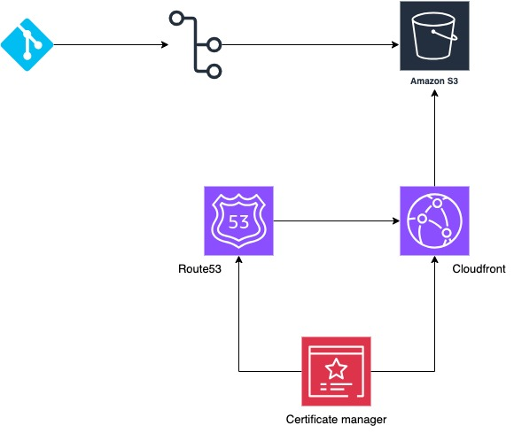

# CV - Automated Static website
### Content and requirements
Simple template to create my CV and deploy it in s3 as a static website with cloudfront and DNS implementation

### Requirements
Previous to start, we need to have some resources created to execute the project without any problems

* AWS Account
* A Domain Name (You can buy it where you preferred it)
* Bucket created in AWS S3 with the same name of your domain name
* Basic code HTML, profile image (If you want to add it), css file, and you can add js code to add more complexity to your template
* Basic worflow and job to run githu actions and update your cloud website automatically on every push (You can paste the same workflow that's here)

> :warning: If you buy your domain name in a different site than AWS Route53, you must configured the DNS servers changing this from your provider to route53 to make it easier

### Architecture

We can see below the architecture diagram related to this implementations. It's very simple.

We start using this repository as source code, then we create the worflow with a job that sync the files of the project to our s3 bucket in AWS, and finally we execute the invalidation of paths in cloudfront to get the actual versión updated in our static website

